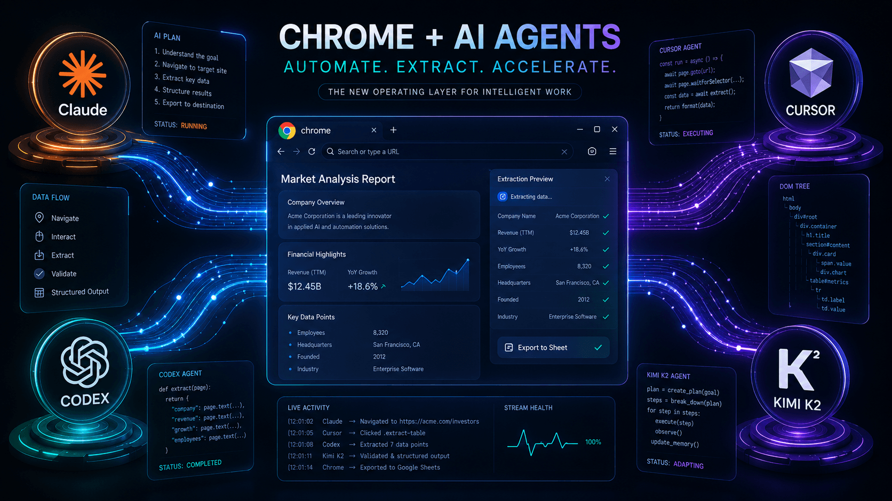

# Chrome Bridge

Chrome Bridge 是开源的 Chrome/Edge 浏览器控制桥。它让 AI Agent 操作本地浏览器：打开网页、点击、填写表单、提取内容、截图、导出 PDF、上传文件。

特点：

- 本地执行：网页内容、Cookie、登录态不经过云端。
- 复用浏览器：直接使用用户当前 Chrome/Edge 的登录状态。
- Agent 通用：Claude Code、Cursor、Codex 等能执行 HTTP 或 shell 命令的 Agent 都可接入。
- 全栈开源：Go 守护进程、TypeScript 扩展、Agent 技能包和官网均可审计。



## 使用场景

- 电商比价：跨平台搜索商品，提取价格和链接。
- 信息调研：打开多个来源，整理结构化信息。
- 表单填写：自动填写重复表单。
- 数据录入：从网页提取数据并录入系统。
- 职位搜索：跨招聘平台筛选职位。
- 网页归档：批量截图或导出 PDF。

## 项目组成

| 子包 | 技术栈 | 职责 |
| --- | --- | --- |
| `chrome-bridge-api` | Go 1.21 + Gin + WebSocket | 本地守护进程，提供 HTTP/WebSocket API |
| `chrome-bridge-plugin` | TypeScript + Vite + Manifest V3 | Chrome/Edge 扩展，执行浏览器操作 |
| `chrome-bridge-skill` | Markdown | Agent 技能包和调用说明 |
| `chrome-bridge-web` | Next.js 16 + React 19 + Tailwind v4 | 官网 |

## 工作方式

```text
AI Agent
  -> 127.0.0.1:10089 HTTP API
  -> 本地守护进程
  -> ws://127.0.0.1:10089/ws
  -> Chrome/Edge 扩展
  -> Chrome DevTools Protocol
  -> 当前浏览器标签页
```

默认监听地址：`127.0.0.1:10089`

扩展使用 `chrome.debugger` 调用 Chrome DevTools Protocol。它会继承当前浏览器的登录态、Cookie 和扩展配置。只连接受信任的本地守护进程。

## 安装

macOS / Linux：

```bash
curl -fsSL https://github.com/zhaocore/chrome-bridge/raw/refs/heads/master/install.sh | bash
```

Windows PowerShell：

```powershell
irm https://github.com/zhaocore/chrome-bridge/raw/refs/heads/master/install.ps1 | iex
```

然后安装浏览器扩展：

[Chrome Web Store - ChromeBridge](https://chromewebstore.google.com/detail/chromebridge/banojplagbjebdnnmklagfagbepelcha)

验证连接：

```bash
~/.chrome-bridge/bin/chrome-bridge status
```

看到 `running: true` 和 `extension_connected: true` 即可使用。

## 常用命令

```bash
~/.chrome-bridge/bin/chrome-bridge start
~/.chrome-bridge/bin/chrome-bridge stop
~/.chrome-bridge/bin/chrome-bridge restart
~/.chrome-bridge/bin/chrome-bridge status
```

获取工具清单：

```bash
curl -s http://127.0.0.1:10089/tools
```

调用示例：

```bash
curl -s -X POST http://127.0.0.1:10089/command \
  -H 'Content-Type: application/json' \
  -d '{"action":"navigate","args":{"url":"https://example.com","newTab":true},"session":"demo"}'
```

## 支持工具

| 工具 | 说明 |
| --- | --- |
| `navigate` | 打开 URL |
| `find_tab` | 查找并复用标签页 |
| `snapshot` | 读取页面无障碍树 |
| `click` / `mouse_click` | 点击元素 |
| `fill` | 填写输入框或可编辑区域 |
| `evaluate` | 执行 JavaScript |
| `screenshot` | 截图并返回文件路径 |
| `save_as_pdf` | 导出当前页面为 PDF |
| `network` | 读取或分析网络请求 |
| `upload` | 上传文件 |
| `list_tabs` | 列出会话标签页 |
| `close_tab` | 关闭当前标签页 |
| `close_session` | 关闭会话全部标签页 |
| `cdp` | 直接调用 CDP 方法 |
| `key_type` / `send_keys` | 输入文本或按键 |

完整参数以 `GET /tools` 返回为准。


## 会话

每个 `session` 对应一组浏览器标签页。不同任务使用不同 session，可减少相互影响。

任务结束后关闭会话：

```bash
curl -s -X POST http://127.0.0.1:10089/command \
  -H 'Content-Type: application/json' \
  -d '{"action":"close_session","args":{},"session":"demo"}'
```

## WebSocket 协议

守护进程与扩展通过 WebSocket 通信。

| 消息类型 | 方向 | 用途 |
| --- | --- | --- |
| `hello` | 扩展 -> daemon | 握手 |
| `hello_ack` | daemon -> 扩展 | 握手确认 |
| `ping` / `pong` | 双向 | 心跳 |
| `tool_call` | daemon -> 扩展 | 工具调用 |
| `tool_result` | 扩展 -> daemon | 执行结果 |

`tool_call` 示例：

```json
{
  "type": "tool_call",
  "requestId": "req-1",
  "payload": {
    "name": "navigate",
    "args": {
      "url": "https://example.com",
      "newTab": true
    }
  }
}
```

## 目录结构

```text
chrome-bridge/
├── install.sh
├── install.ps1
├── AGENT_INSTALL.md
├── chrome-bridge-api/
│   ├── cmd/chrome-bridge/
│   └── internal/
├── chrome-bridge-plugin/
│   ├── src/background/
│   ├── src/popup/
│   └── public/manifest.json
├── chrome-bridge-skill/
│   ├── SKILL.md
│   └── references/operations.md
└── chrome-bridge-web/
    ├── app/
    ├── components/
    └── docs/
```

## FAQ

**会上传网页内容吗？**

不会。浏览器操作在本机完成。Agent 自身的模型请求按对应平台规则处理。

**和 Playwright、Selenium 有什么区别？**

Playwright 和 Selenium 面向脚本自动化。Chrome Bridge 面向 AI Agent，并复用用户当前浏览器环境。

**收费吗？**

Chrome Bridge 免费开源。费用只取决于你使用的 Agent 或模型服务。

**支持哪些 Agent？**

任何能执行 HTTP 请求或 shell 命令的 Agent 都能接入。安装脚本会尝试为 Claude Code、Cursor、Codex 等运行时注入技能文件。

## 参考

- [GitHub - chrome-bridge](https://github.com/zhaocore/chrome-bridge)
- [Chrome Web Store - ChromeBridge](https://chromewebstore.google.com/detail/chromebridge/banojplagbjebdnnmklagfagbepelcha)
- [Chrome DevTools Protocol](https://chromedevtools.github.io/devtools-protocol/)
- [Chrome Extensions Manifest V3](https://developer.chrome.com/docs/extensions/mv3/intro/)
